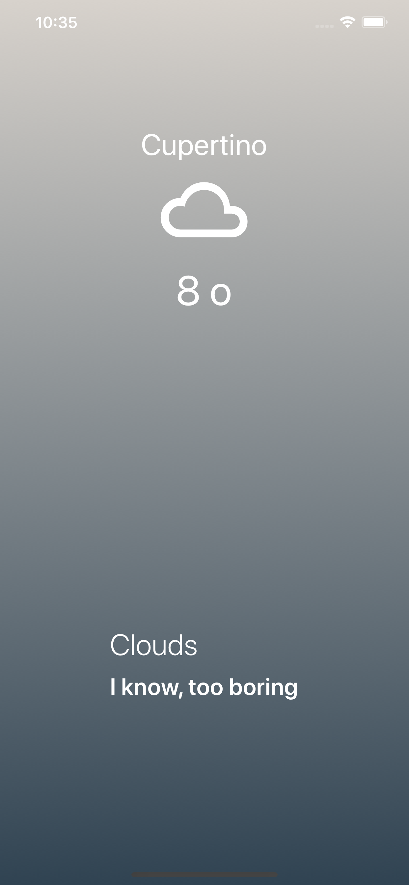

# jw_weather_react

## 앱 소개 및 설명 
- Expo.io와 React를 이용한 날씨 모바일앱 및 반응형 웹앱
- 간단한 Loading Page 구현
- Expo의 Location API와 openWeather를 이용하여 사용자의 GPS위치 파악 및 위도,경도를 통한 실제 현재 기상 데이터로 구현
- Expo API를 통해 얻은 Icon과 Gradient를 통해 디자인

## 앱 살펴보기
- 간단한 로딩페이지
- 현위치, 날씨(아이콘으로 표시), 온도, 날씨 표현으로 구성.

## 앱 접속 및 테스트
1. Android 및 ios 기기(스마트폰, 갤럭시탭, 아이패드)에서 Expo Client 앱을 다운 받는다.
2. 아이디: junwoochang
   비밀번호: testtest12
   로 로그인
3. [jw-weather-react](https://expo.io/--/to-exp/exp%3A%2F%2Fexp.host%2F%40junwoochang%2Fjw-weather-app) 링크로 앱에 접속
4. 결과물
   
   
## TODO
- 로컬 서버 연동
- build 및 deploy
